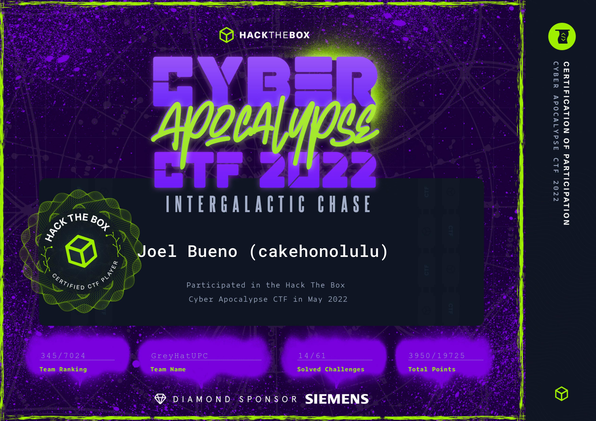
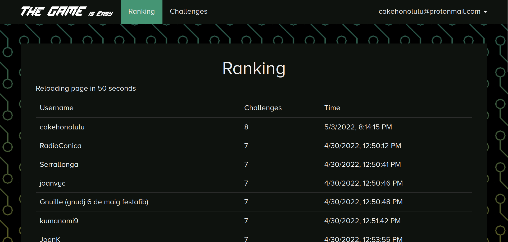
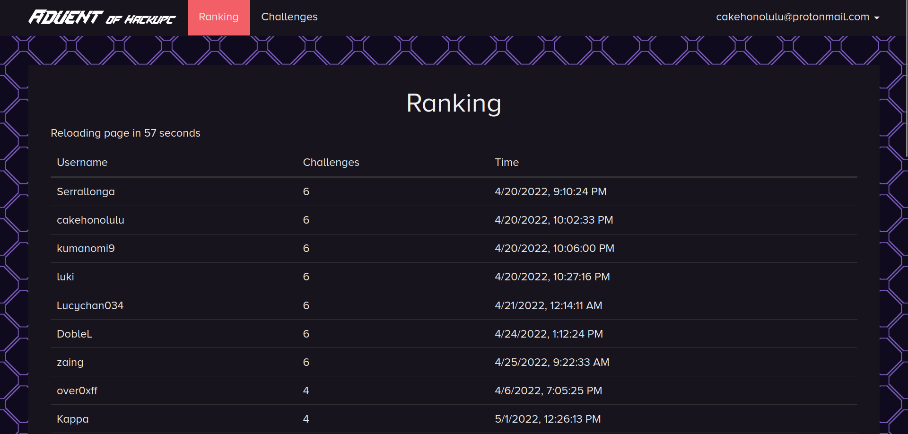

## 🫧 I'm Joel, welcome to my profile!

### What I'm doing right now:

- 🚧 Currently enrolled in a Full-Stack Bootcamp offered by T-Systems in collaboration with Esplai Jove.
- 📖 Studying a Computer Science Degree @ UOC (Universitat Oberta de Catalunya)
- 🚩 Constantly improving my offensive security skills (Reverse engineering, binary/web exploitation, vuln. search, recon...).
- ⚡ Studying hardware architecture whilst developing emulators for <a href="https://github.com/cakehonolulu/GameGirl">Nintendo Game Boy (DMG-01)</a> and <a href="https://github.com/cakehonolulu/SimpleStation">Sony PlayStation 1 (PSX)</a>.
- 🔭 Taking a glance on Just-in-Time compilation techniques.
- 🧑🏽‍💻 Open for collaborations!

### What I love doing:
- 📖 Learning new things everyday.
- 🎮 Engaging in CTF (Capture-the-Flag) Competitions; great way to practise offensive-security skills in a gamified way.
- ✨ Programming personal projects to further improve my skill-set.

### Current skillset

 

 
 
<h3>My HackTheBox Profile:</h3>

### Latest CTF

  
<h3>Old CTFs</h3>

 
<a href="https://cakehonolulu.github.io/writeups/hackupc/2022/thegame.html"><h2>HackUPC's 2022 The Game CTF</h2></a>

<a href="https://cakehonolulu.github.io/writeups/hackupc/2022/aoc.html"><h2>2022 Advent of HackUPC CTF (Prelude for The Game)</h2></a>
  
 

### Connect with me

